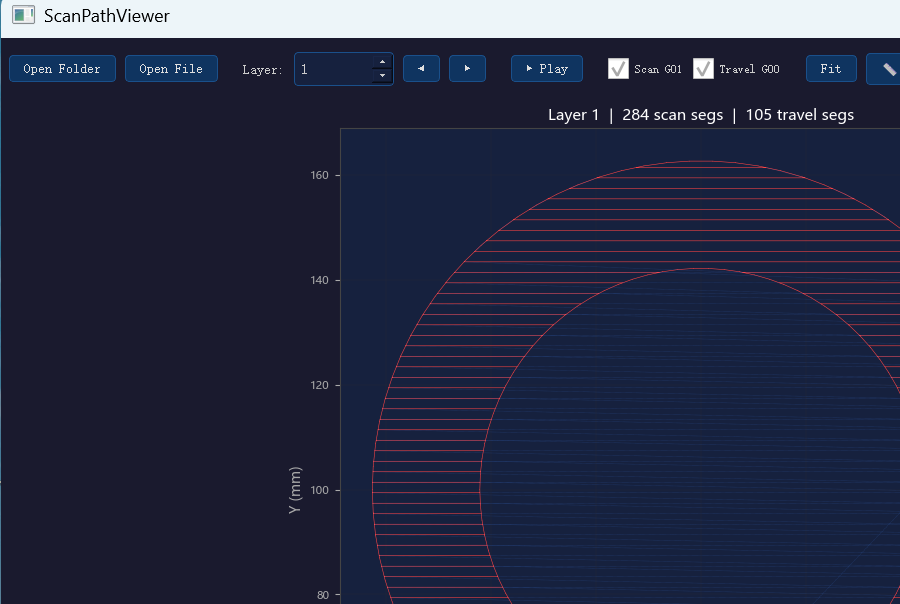

# ScanPathViewer · 扫描路径查看器

**EN** | A fast, zero-config, layer-by-layer scan-path / G-code viewer for SLS·SLM 3D printing, laser marking and CNC. Single Python file, dark engineering UI, bilingual (EN/中文).

**中文** | 面向 SLS/SLM 3D打印、激光打标与CNC 的逐层扫描路径查看器。单文件、零配置、深色工程界面、中英双语。



## Features · 功能

- **Layer navigation** — spinbox / ◀▶ / arrow keys / auto-play animation
  **逐层浏览** — 层号框 / 前后翻层 / 方向键 / 自动播放动画
- **G01 scan lines & G00 travel moves rendered separately**, toggle each on/off
  **扫描线(G01)与跳转线(G00)分色渲染**，可分别开关
- **Zoom / pan / fit** — mouse wheel zoom, middle-drag pan
  **缩放/平移/适应** — 滚轮缩放，中键拖动
- **Distance measurement** — click twice, read mm
  **距离测量** — 点两下，读毫米
- **Snapshot export** (PNG) · **截图导出**
- **Background preloading** — first layer shows instantly, the rest load behind
  **后台预加载** — 首层秒开，其余层后台加载
- **Drag & drop** a folder or a single `.nc` file · **拖放**文件夹或单个NC文件

## Quick start · 快速开始

```bash
pip install -r requirements.txt

# generate demo data (30 layers) · 生成演示数据
python examples/generate_demo.py

# view it · 查看
python scan_path_viewer.py examples/demo_data
```

Or just `python scan_path_viewer.py` and drag a folder onto the window.
或直接运行后把数据文件夹拖进窗口。

`--lang en` / `--lang zh` forces UI language (defaults to system locale, runtime-switchable via the EN/中文 button).
`--lang` 可强制界面语言（默认跟随系统，运行中可用右上按钮切换）。

## Supported data layouts · 支持的数据组织

| Layout | Example | Note |
|---|---|---|
| Plain layer files | `1.nc, 2.nc, …` (optionally under `G/<sub>/`) | one or more files per layer, leading number = layer |
| Grouped layer files | `12-0-0.nc, 12-0-1.nc` | first number = layer, duplicates deduped |
| Merged JSON index | `merged/index.json` + per-layer JSON | fastest for huge jobs, schema below |

**NC parsing**: lines starting with `G00`/`G01` carrying `X…Y…` coordinates; everything else is ignored, so most post-processor flavors just work.
**NC解析**：识别带 `X…Y…` 坐标的 `G00/G01` 行，其余行忽略——大多数后处理器风格开箱即用。

<details>
<summary>merged/index.json schema · 合并索引格式</summary>

```jsonc
// merged/index.json
{
  "layers": [ {"num": 1, "file": "L1.json"}, ... ],
  "bounds": {"minX": 0, "minY": 0, "maxX": 200, "maxY": 200}   // optional
}
// merged/L1.json
{ "data": [ [x1, y1, x2, y2, kind], ... ] }   // kind: 0 = G00 travel, 1 = G01 scan
```
</details>

## Keyboard · 快捷键

`←/→` layer 翻层 · `Space` play 播放 · `F` fit 适应 · `G` toggle G00 · `H` toggle G01

## Why · 缘起

Born on a production sand-mold SLS 3D-printing line where we needed to eyeball millions of scan vectors per job before committing sand and laser time. Open-sourced in the hope it saves someone else's shift.
诞生于铸造砂型SLS打印产线——在真砂真激光开动之前，得先把百万级扫描矢量看个明白。开源出来，愿它也能帮你省下一个夜班。

## License

MIT © 2026 yunlongcasting
